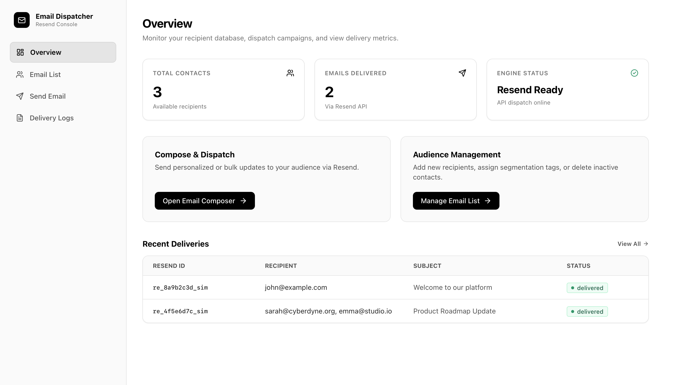
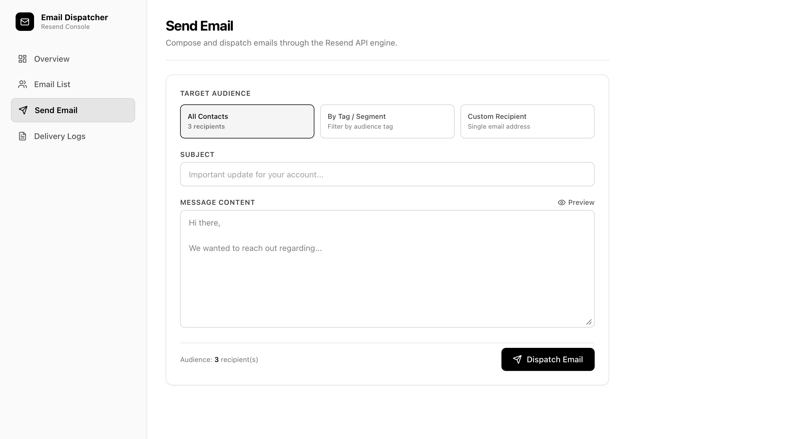
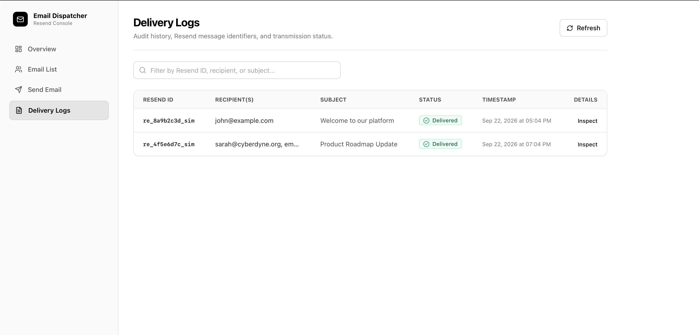

# Simple Cold Email

[](https://github.com/example/simple-cold-email/actions/workflows/ci.yml)
[](LICENSE)
[](https://nextjs.org/)
[](https://react.dev/)
[](https://tailwindcss.com/)
[](https://resend.com/)
[](https://www.typescriptlang.org/)

A minimalist, high-performance cold email dispatch and contact management platform built with Next.js 16 (App Router), React 19, Tailwind CSS v4, Zod, and Resend.

Designed for founders, growth teams, and developers who need a reliable, self-hostable email dispatch console without enterprise bloat.

---

## Screenshots

<p align="center">
  
</p>

<p align="center">
  
</p>

<p align="center">
  
</p>

---

## Key Features

- **Audience Management**: Organize contacts with custom tags (`VIP`, `Lead`, `Customer`), instant client-side search, and deduplicated records.
- **Precision Dispatch Engine**: Target dispatches to your entire list, specific segments by tag, or a single recipient.
- **Dual-Mode Resend Integration**:
  - **Live Delivery**: Send production emails via the official Resend API with verified domains.
  - **Simulation Mode**: Built-in mock dispatch mode for local testing without an active Resend account.
- **Delivery Audit Logging**: Inspect historical transmissions, Resend message identifiers, delivery statuses, and error diagnostics.
- **Session Authentication**: Lightweight cookie-backed session authentication with configurable administrative credentials.
- **Container & Serverless Ready**: Works out of the box with Docker or on serverless environments like Vercel with automatic `/tmp` filesystem fallback.

---

## Tech Stack

| Layer | Technology |
|---|---|
| **Framework** | Next.js 16 (App Router) |
| **UI Library** | React 19 |
| **Styling** | Tailwind CSS v4 |
| **Icons** | Lucide React |
| **Email Delivery** | Resend Node SDK |
| **Validation** | Zod |
| **Language** | TypeScript 5 |
| **Package Manager** | pnpm |

---

## Architecture Overview

```
┌────────────────────────────────────────────────────────┐
│                   Next.js Web Console                  │
│   - Overview Dashboard   - Audience Contacts Manager   │
│   - Email Composer       - Transmission Audit Logs     │
└───────────────────────────┬────────────────────────────┘
                            │ REST APIs
┌───────────────────────────▼────────────────────────────┐
│                    Route Handlers                      │
│   /api/auth/*     /api/contacts/*    /api/emails/*     │
└─────────────┬───────────────────────────┬──────────────┘
              │                           │
              ▼                           ▼
   ┌─────────────────────┐     ┌──────────────────────┐
   │    Data Storage     │     │    Email Gateway     │
   │  - Local JSON Files │     │  - Resend Live API   │
   │  - Serverless /tmp  │     │  - Simulation Mode   │
   │  - In-Memory Cache  │     └──────────────────────┘
   └─────────────────────┘
```

---

## Quickstart Guide

### Prerequisites

- **Node.js**: `20.x` or `22.x`
- **pnpm**: `10.x` or higher (`corepack enable pnpm` or `npm i -g pnpm`)

### 1. Clone the Repository

```bash
git clone https://github.com/example/simple-cold-email.git
cd simple-cold-email
```

### 2. Install Dependencies

```bash
pnpm install
```

### 3. Setup Environment Variables

Copy the example environment configuration:

```bash
cp .env.example .env.local
```

The default values enable **Simulation Mode** immediately, allowing you to test all dispatch workflows locally without needing an external API key.

### 4. Run Development Server

```bash
pnpm run dev
```

Visit [http://localhost:3000](http://localhost:3000) in your browser.

**Default Login Credentials:**
- **Email**: `demo@client.com`
- **Password**: `password123`

---

## Environment Variables

| Variable | Required | Default | Description |
|---|---|---|---|
| `RESEND_API_KEY` | Optional | `re_test_placeholder` | Resend API key. If omitted or containing `placeholder`, the app runs in Simulation Mode. |
| `FROM_EMAIL` | Optional | `onboarding@resend.dev` | Sender email address. Use `onboarding@resend.dev` for sandbox testing or your verified domain. |
| `ADMIN_EMAIL` | Optional | `demo@client.com` | Administrator login email. |
| `ADMIN_PASSWORD` | Optional | `password123` | Administrator login password. |

---

## API Reference

### Authentication

#### `POST /api/auth/login`
Authenticates a user session and sets a secure `session_token` HTTP cookie.

- **Request Body**:
  ```json
  {
    "email": "demo@client.com",
    "password": "password123"
  }
  ```
- **Response** (`200 OK`):
  ```json
  {
    "success": true,
    "email": "demo@client.com"
  }
  ```

#### `POST /api/auth/logout`
Terminates the session and clears cookies.

#### `GET /api/auth/session`
Returns the active authenticated session status.

---

### Contacts Management

#### `GET /api/contacts`
Retrieves all stored contacts.

- **Response** (`200 OK`):
  ```json
  {
    "contacts": [
      {
        "id": "c1",
        "name": "Sarah Connor",
        "email": "sarah@cyberdyne.org",
        "tag": "VIP",
        "createdAt": "2026-09-20T15:13:38.976Z"
      }
    ]
  }
  ```

#### `POST /api/contacts`
Creates a new recipient contact.

- **Request Body**:
  ```json
  {
    "name": "Alex Mercer",
    "email": "alex@gentek.org",
    "tag": "Lead"
  }
  ```
- **Response** (`201 Created`):
  ```json
  {
    "contact": {
      "id": "c_k4z9x1a2",
      "name": "Alex Mercer",
      "email": "alex@gentek.org",
      "tag": "Lead",
      "createdAt": "2026-09-22T12:00:00.000Z"
    }
  }
  ```

#### `DELETE /api/contacts/:id`
Deletes a recipient contact by ID.

- **Response** (`200 OK`):
  ```json
  {
    "success": true,
    "id": "c_k4z9x1a2"
  }
  ```

---

### Email Dispatch & Logs

#### `POST /api/emails/send`
Dispatches an email campaign to all recipients, a segmented tag group, or a custom email address.

- **Request Body**:
  ```json
  {
    "target": "tag",
    "targetTag": "VIP",
    "subject": "Exclusive Partner Invitation",
    "body": "Hello,\n\nYou are invited to our private briefing."
  }
  ```
- **Response** (`200 OK`):
  ```json
  {
    "success": true,
    "resendId": "re_8a9b2c3d_sim",
    "recipientCount": 1,
    "isSimulated": true,
    "log": {
      "id": "log_x7y8z9",
      "resendId": "re_8a9b2c3d_sim",
      "to": "sarah@cyberdyne.org",
      "from": "onboarding@resend.dev",
      "subject": "Exclusive Partner Invitation",
      "body": "Hello,\n\nYou are invited to our private briefing.",
      "status": "delivered",
      "createdAt": "2026-09-22T12:05:00.000Z"
    }
  }
  ```

#### `GET /api/emails/logs`
Returns the historical record of email dispatches.

---

### Configuration Status

#### `GET /api/config/status`
Checks whether Resend and administrative credentials are configured.

---

## Docker Deployment

Build and run using the included multi-stage `Dockerfile`:

```bash
# Build Docker image
docker build -t simple-cold-email .

# Run container
docker run -p 3000:3000 \
  -e RESEND_API_KEY="re_your_api_key" \
  -e FROM_EMAIL="team@yourdomain.com" \
  -e ADMIN_EMAIL="admin@yourdomain.com" \
  -e ADMIN_PASSWORD="your-strong-password" \
  simple-cold-email
```

Access the service at [http://localhost:3000](http://localhost:3000).

---

## Directory Structure

```
├── .github/
│   ├── ISSUE_TEMPLATE/
│   │   ├── bug_report.md
│   │   └── feature_request.md
│   ├── workflows/
│   │   └── ci.yml
│   └── PULL_REQUEST_TEMPLATE.md
├── data/
│   ├── contacts.json
│   └── logs.json
├── src/
│   ├── app/
│   │   ├── api/
│   │   │   ├── auth/
│   │   │   ├── config/
│   │   │   ├── contacts/
│   │   │   └── emails/
│   │   ├── dashboard/
│   │   │   ├── contacts/
│   │   │   ├── logs/
│   │   │   ├── send/
│   │   │   ├── layout.tsx
│   │   │   └── page.tsx
│   │   ├── login/
│   │   │   └── page.tsx
│   │   ├── globals.css
│   │   ├── layout.tsx
│   │   └── page.tsx
│   └── lib/
│       ├── resend.ts
│       ├── storage.ts
│       ├── types.ts
│       └── validations.ts
├── .dockerignore
├── .env.example
├── CHANGELOG.md
├── CODE_OF_CONDUCT.md
├── CONTRIBUTING.md
├── Dockerfile
├── LICENSE
├── package.json
├── pnpm-lock.yaml
├── README.md
└── tsconfig.json
```

---

## Contributing

Contributions are welcomed! Please read the [Contributing Guidelines](CONTRIBUTING.md) and [Code of Conduct](CODE_OF_CONDUCT.md) before submitting pull requests.

To run tests and code validation locally:

```bash
pnpm run lint
pnpm run typecheck
pnpm run build
```

---

## License

This project is licensed under the [MIT License](LICENSE).
